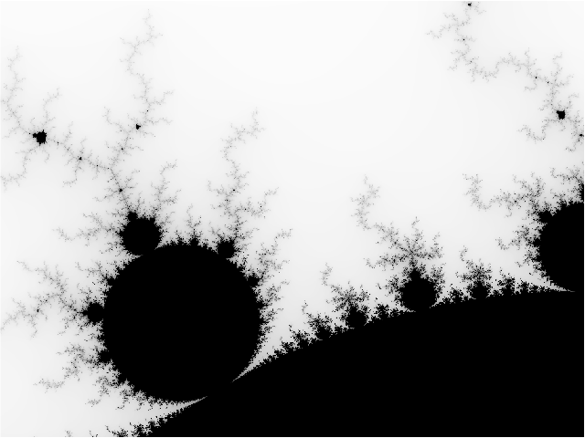

# Mandelbrot in Odin

This repository contains an [Odin](https://odin-lang.org/) program for calculating the Mandelbrot set. 

The program compiles to a single native executable. It can render the Mandelbrot set directly to the terminal as ASCII art or produce a data file for `gnuplot` to generate a high-resolution PNG image.

### Other Language Implementations

This project is part of a suite of mandelbrot implementations in different languages.

Single Thread/Multi-thread shows the number of seconds it takes to do a 5000x5000 calculation.


| Language    | Repository                                                           | Single Thread   | Multi-Thread | Simd | Multi-Thread + Simd |
| :--------   | :------------------------------------------------------------------- | ---------------:| -----------: | ----:| ------------------: |
| Awk         | [mandelbrot-awk](https://github.com/jesper-olsen/mandelbrot-awk)     |           417.9 |              |      |                     |
| C           | [mandelbrot-c](https://github.com/jesper-olsen/mandelbrot-c)         |             3.6 |          0.6 |  0.7 |               0.2   |
| Erlang      | [mandelbrot_erl](https://github.com/jesper-olsen/mandelbrot_erl)     |            35.6 |          8.3 |      |                     |
| Fortran     | [mandelbrot-f](https://github.com/jesper-olsen/mandelbrot-f)         |             4.5 |              |      |                     |
| Java        | [mandelbrot-java](https://github.com/jesper-olsen/mandelbrot-java)   |             3.9 |          0.8 |  1.4 |               0.5   |
| Lua         | [mandelbrot-lua](https://github.com/jesper-olsen/mandelbrot-lua)     |            33.2 |              |      |                     |
| Mojo        | [mandelbrot-mojo](https://github.com/jesper-olsen/mandelbrot-mojo)   |             3.8 |          1.2 |  0.7 |               0.4   |
| Nushell     | [mandelbrot-nu](https://github.com/jesper-olsen/mandelbrot-nu)       |   (est) 17186.6 |              |      |                     |
| **Odin**    | [mandelbrot-odin](https://github.com/jesper-olsen/mandelbrot-odin)   |             4.4 |              |      |                     |
| Python      | [mandelbrot-py](https://github.com/jesper-olsen/mandelbrot-py)       |     (pure) 93.3 | (jax)    5.9 |      |                     |
| R           | [mandelbrot-R](https://github.com/jesper-olsen/mandelbrot-R)         |           335.0 |              |
| Rust        | [mandelbrot-rs](https://github.com/jesper-olsen/mandelbrot-rs)       |             4.7 |          1.3 |      |                     |
| Swift       | [mandelbrot-swift](https://github.com/jesper-olsen/mandelbrot-swift) |             4.5 |          1.2 |  1.3 |               0.7   |
| Tcl         | [mandelbrot-tcl](https://github.com/jesper-olsen/mandelbrot-tcl)     |           306.9 |              |      |                     |
| Zig         | [mandelbrot-zig](https://github.com/jesper-olsen/mandelbrot-zig)     |             4.9 |          0.9 |  0.7 |               0.3   |


---

## Prerequisites

You will need the following installed:

1.  The **Odin Compiler**.
2.  **Make** (optional, but recommended for easy building).
3.  **Gnuplot** (required *only* for generating PNG images).

---

## Build

You can compile the program dirextly or with the provided Makefile - assumes you have `odin` in your path.

```sh
make
odin build src -out:src.bin -o:speed
```


---

## Usage

The compiled executable can be configured via command-line arguments using a `key=value` format.

### 1. ASCII Art Output

To render the Mandelbrot set directly in your terminal, run the executable.

```sh
./mandelbrot.bin
....................................................................................................
....................................................................................................
....................................................................................................
....................................................................................................
....................................................................................................
....................................................................................................
..............................................................................._....................
..............................................................................._....................
................................................................................_...................
..............................................................................._....................
....................................................................................................
....................................................................................._.._.__........
.........................................................................................._.........
..........................................................................................._..._....
....................................................................................................
._..................................................................................................
.._.................................................................................................
.........................a..........................................................................
............................................................................................._......
.._......................_....................................................................._M...
..............................................................................................._M_..
........................_._....................................................................__...
......._...............__................................................................._.........
....._MM_............._............................................................................_
......_M__._.............................................................................._........_
......._..._........__..............................................................................
...._......._._........................_............................................................
...._........___...._...............................................................................
...._..........___._...................._...........................................................
............._....__..._........................................................................._.a
...................._......................................................................_...._2__
...................._._.................._..............................................__..a....__a
....................____..._..........__._................................................_.a_....__
...................___.._.._.._......._.._....._................_......................_..a__..____a
.....................__._.._.__........_........................................._...a___a_a__._aa_W
.....................____.__._........__......................__.................._....__.._a___MaWM
....................__2M_a_a...._......_____..........................................._..__aaaMMMMM
....................__MMWaaa__........____._..........................................._..M_2MMMMMMM
................._..__MMMMM__2.._._.....a_...................._............................_MMMMMMMM
.................aaa_aMMMMMM__2._a.._..aa_....................._._._......................aaaMMMMMMM
.............__a____WMMMMMMM__2__a_._a__M__........................__..__.._............._2__MMMMMMM
............_..2...__MMMMMMM___M_M_Wa_MaM_.........................a___a.._..........a..__MaMMMMMMMM
...................__MMMMMMaMMMMMM2M_MMMa_2........................____M_.............__..aaMMMMMMMM
.................___a_MMMMMMMMMMMMMMM2MMMM_...._.....................__2a_aa..._..........a_MMMMMMMM
....................___aMMMMMMMMMMMMMMMMM_2.._....................___a____W2..._.........._aMMMMMMMM
...._........_..._.___WMMMMMMMMMMMMMMMMMa__.___................_.__a__aa__......__........__aMMMMMMM
........_......_.___MMMMMMMMMMMMMMMMMMMMMM2____2_......._.........._._2Ma_a_.....a_........_aMMMMMMM
.........._.....__aaaMMMMMMMMMMMMMMMMMMMMMaa_a_....................._aMMM2MM..M.M2Ma..W_...__aMMMMMM
.........a_......_MMMMMMMMMMMMMMMMMMMMMMMMMMMa....................___2aMMMWW_.._a_W___2M______aMMMMM
.........._......__2MMMMMMMMMMMMMMMMMMMMMMMM2__.........._.._.....MaaWMMMMM2_a..MMMM___M_2M_2___MMMM
..........__..a__W2MMMMMMMMMMMMMMMMMMMMMMMMMa_W_..........__a._....MaMMMMMMM_MM_MMMM_MMMaaM2MWMMMMMM
......_._____._W__2MMMMMMMMMMMMMMMMMMMMMMMMMM___.........__aaW2_..._2MMMMMMM__MWMMMMMMMMMMMMMMMMMMMM
.......2_.____aaMaMMMMMMMMMMMMMMMMMMMMMMMMMMMW_..........__MW___.____2MMMMMaaMMMMMMMMMMMMMMMMMMMMMMM
...._._....._a2MMMMMMMMMMMMMMMMMMMMMMMMMMMMMMa_._..._.....2_MMM__2M_a_MMMMMMMMMMMMMMMMMMMMMMMMMMMMMM
....___....._aaMMMMMMMMMMMMMMMMMMMMMMMMMMMMMM_M......W...._2MMM__MMa2MMMMMMMMMMMMMMMMMMMMMMMMMMMMMMM
._..._......___aMMMMMMMMMMMMMMMMMMMMMMMMMMMMMM_......_2aM___MMMaMMMMMMMMMMMMMMMMMMMMMMMMMMMMMMMMMMMM
............._____MMMMMMMMMMMMMMMMMMMMMMMMMMM_W_....._aMM_2_MMMMMMMMMMMMMMMMMMMMMMMMMMMMMMMMMMMMMMMM
.........._....._2MMMMMMMMMMMMMMMMMMMMMMMMMMMM_..._2M_MMMMMMMMMMMMMMMMMMMMMMMMMMMMMMMMMMMMMMMMMMMMMM
................_MMMMMMMMMMMMMMMMMMMMMMMMMMMM2_.2._MaMaMMMMMMMMMMMMMMMMMMMMMMMMMMMMMMMMMMMMMMMMMMMMM
............_...__MMMMMMMMMMMMMMMMMMMMMMMMMMM____MaMMMMMMMMMMMMMMMMMMMMMMMMMMMMMMMMMMMMMMMMMMMMMMMMM
............______2MMMMMMMMMMMMMMMMMMMMMMMMM___MMMMMMMMMMMMMMMMMMMMMMMMMMMMMMMMMMMMMMMMMMMMMMMMMMMMM
............._a__WMMMMMMMMMMMMMMMMMMMMMMMMMWM_MMMMMMMMMMMMMMMMMMMMMMMMMMMMMMMMMMMMMMMMMMMMMMMMMMMMMM
............____2MMaMMMMMMMMMMMMMMMMMMMMMMM___MMMMMMMMMMMMMMMMMMMMMMMMMMMMMMMMMMMMMMMMMMMMMMMMMMMMMM
...........a._..___aMMMMMMMMMMMMMMMMMMMMMMM_MMMMMMMMMMMMMMMMMMMMMMMMMMMMMMMMMMMMMMMMMMMMMMMMMMMMMMMM
............._....__aMMMMMMMMMMMMMMMMMMMMMMMMMMMMMMMMMMMMMMMMMMMMMMMMMMMMMMMMMMMMMMMMMMMMMMMMMMMMMMM
........__._.....W__2MMMMMMMMMMMMMMMMMMMMMMMMMMMMMMMMMMMMMMMMMMMMMMMMMMMMMMMMMMMMMMMMMMMMMMMMMMMMMMM
........_......._._M2_WMMMMMMMMMMMMMMMMMMMMMMMMMMMMMMMMMMMMMMMMMMMMMMMMMMMMMMMMMMMMMMMMMMMMMMMMMMMMM
.................aa..WMMMMMMMMMMMMMMMMMMMMMMMMMMMMMMMMMMMMMMMMMMMMMMMMMMMMMMMMMMMMMMMMMMMMMMMMMMMMMM
.....................___aM2MMMMMMMMMMMMMMMMMMMMMMMMMMMMMMMMMMMMMMMMMMMMMMMMMMMMMMMMMMMMMMMMMMMMMMMMM
...............__...._2_a__aaMMaaaMMMMMMMMMMMMMMMMMMMMMMMMMMMMMMMMMMMMMMMMMMMMMMMMMMMMMMMMMMMMMMMMMM
...................._..._._M___MMMMMMMMMMMMMMMMMMMMMMMMMMMMMMMMMMMMMMMMMMMMMMMMMMMMMMMMMMMMMMMMMMMMM
..........................____aMMMMMMMMMMMMMMMMMMMMMMMMMMMMMMMMMMMMMMMMMMMMMMMMMMMMMMMMMMMMMMMMMMMMM
........................._2_aMMMMMMMMMMMMMMMMMMMMMMMMMMMMMMMMMMMMMMMMMMMMMMMMMMMMMMMMMMMMMMMMMMMMMMM
.......................MaMMMMMMMMMMMMMMMMMMMMMMMMMMMMMMMMMMMMMMMMMMMMMMMMMMMMMMMMMMMMMMMMMMMMMMMMMMM
...................a2_._M_2MMMMMMMMMMMMMMMMMMMMMMMMMMMMMMMMMMMMMMMMMMMMMMMMMMMMMMMMMMMMMMMMMMMMMMMMM
```

You can change the view and resolution by passing parameters:
```sh
# Zoom in on a different area with a wider view
./mandelbrot.bin width=120 ll_x=-0.75 ll_y=0.1 ur_x=-0.74 ur_y=0.11
```

### 2. PNG Image Generation

To create a high-resolution PNG, you first generate a data file and then process it with `gnuplot`.

**Step 1: Generate the data file**
Set `png=1` and specify the desired dimensions. Redirect the output to a file.

```sh
./mandelbrot.bin png=1 width=1000 height=750 > image.dat
```

**Step 3: Run gnuplot**
This will read `image.dat` and create `mandelbrot.png`.

```sh
gnuplot topng.gp
```
The result is a high-quality `mandelbrot.png` image.



## Performance

Benchmarks were run on an **Apple M5** system with `odin version dev-2026-07-nightly:819fdc7`

**Generating a 1000x750 data file:**
```sh
time ./mandelbrot.bin png=1 width=1000 height=750 > image.dat
0.18s user 0.01s system 97% cpu 0.193 total
```

**Generating a 5000x5000 data file:**
```sh
time ./mandelbrot.bin png=1 width=5000 height=5000 > image.dat
4.31s user 0.04s system 99% cpu 4.375 total
```

